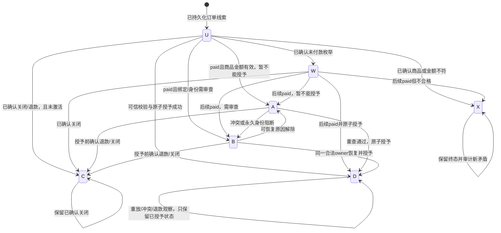

# 爱发电支付可靠性：Phase 2 Design Review

评审日期：2026-09-29（Asia/Shanghai）。范围：设计与破坏性验证计划。本文不包含可执行 migration、实现补丁、部署或生产补发操作。

结论：复用现有 intents、orders、Worker、Cron、共享前端，增加可信查询后的事务入口、可恢复重试与持久扫描进度。设计可解决已确认的冻结 unresolved、分页停滞和前端误降级；尚不能宣称 G1–G10 全部通过。G1/G2 依赖平台发现能力与事实稳定性；G4 在数据库完全不可用时只能依靠重发现；外部 API 深度模式的服务端权益检查仍缺失。真实数据库并发和 crash 实验均待实施阶段执行。

## 1. Source-of-truth reconciliation

### 本轮只读证据

| 对象 | 当前证据 | 对设计的影响 |
| --- | --- | --- |
| xixi main | HEAD 与 origin/main 均为 `c1dbad9893a3a2d8a5f5ad3f3f5e98d89476bdb2`；检查时工作区干净 | 保留 main 的其余现有功能，不能用旧 Worker 直接发布 |
| 线上 afdianpay | version `13442a1f-4dce-4590-87b3-fcff297c203a`；2026-09-27 02:19:48 UTC 发布 | 作为当前支付执行行为基线 |
| 线上 Worker bundle | `worker.js` 22,797 bytes；SHA-256 `61d2fdce390777cc7a53dda855b3c1cc69871eef49e6671cf9e5d1638d9b1d69` | 可精确比对执行源码 |
| 已提交的匹配修复 | `32d0d58f9df2ffa09a75c440fd0bb82d4dbb8d6c`，位于 `claude/ghost-account-bug-in-login-registration-ecfeea` 及其远端分支；提交时间 2026-09-27 10:21:08 +08:00 | main 未合入该提交；不是找不到来源的 production-only 补丁 |
| 源码到 bundle 验证 | 对上述提交的 `workers/afdianpay/worker.js` 使用当前安装的 esbuild 进行内存构建，移除产物末尾 sourceMappingURL 后与生产 bundle 精确一致；es2022/esnext 两次均匹配 | 已证明当前生产执行源码对应这份 Git 源码，超出仅比较某个函数的证据强度 |
| main 与修复源码 | main Git blob `6a76fe1a7ce2af5b6c523affcf62071c23416386`；修复 blob `d23c65e33df0e9746e18f1540cc881b761c5b9fb`；差异仅为引用分类的 5 行增加、4 行删除 | 将 custom_order_id 始终解释为 intent；不能按 UUID 外形降级为 legacy user ID |
| Pages sunland | production branch main；deployment `631e678d-82a4-4c98-95df-8fe4191104e9`，2026-09-27 13:39:14 UTC，GitHub push，commit c1dbad… | Pages 和支付 Worker 目前不是同一 Git revision |
| 线上数据库 | 已有 `20260926002710_account_deletion_identity_guardrails` 和 `20260927065855_trace_foundation`；当前 xixi migration 目录未完整包含它们 | 以线上 catalog 的函数、ACL、RLS、触发器为约束，不能用 9 月 5 日旧函数覆盖 |

线上发布时间略早于对应 commit；符合“部署工作副本后提交”的可能过程，但不能据此确认部署者或历史操作。当前 bundle 没有发现脱离该提交的 Dashboard 源码差异；没有完整 Dashboard audit log，不能断言历史上从未直接编辑。

生产函数指纹（本轮读取 `md5(pg_get_functiondef(...))`，用于后续检查漂移，不是签名或安全证明）：

| 函数 | 指纹 | 关键约束 |
| --- | --- | --- |
| 六参数 `sunland_activate_pro_from_payment` | `315d47d9e2f77e5f599e1098b5ea7934` | SECURITY INVOKER；固定 search_path；service_role 执行；含 active profile guard |
| 二参数同名 RPC | `dc1110b67ee43b6ba2c02da43065b603` | SECURITY DEFINER；空 search_path；service_role 执行；仍有直接授予路径 |
| `sunland_get_or_create_pro_payment_intent` | `2ded00d52771aa63eeb23d3b4716c45c` | 保留认证、active identity 和 owner 契约 |
| `sunland_resolve_pro_payment_order` | `cbf61872f9dc04cf11690888020bf07b` | 旧人工处理入口，必须停止未经 query-order 的授予 |
| `sunland_serialize_pro_payment_order_insert` | `b25acb1163b951ed486437870193d6a6` | 当前锁键为单参数 `pg_advisory_xact_lock(hashtext(order_id))` |

### 进入实现前的唯一基线

1. 在隔离的实现分支中以当前 main 为基础，只整合 `32d0d58…` 的支付引用分类差异，不合并整条分支的无关工作。本文没有执行该操作。
2. 先建立“匹配线上原行为”的 UUID 回归测试，再修改可靠性逻辑。旧测试若期待 custom UUID 被视为 legacy，应明确纠正，不通过改生产来迎合旧 fixture。
3. 补齐线上 guardrails 的可追踪源码。trace migration 在 app 仓库有来源；guardrails 的 xixi Git 来源尚未找到。对补齐文件仅登记已有迁移，不把已应用版本重新执行。
4. 固化发布 manifest：Git SHA、源码与 bundle hash、Worker version、Pages deployment/commit、migration 列表、相关函数/ACL/RLS 指纹、配置及 secret **名称**。平台凭据和值不入 manifest。
5. 后续发布必须来自这条可追踪 Git 基线。平台现状只作首次导入与漂移检测证据，不作为后续人工编辑渠道。

“同一 revision”不能覆盖已经独立发布的历史：本轮明确承认 Worker、Pages、DB 来自不同发布记录。未来由 manifest 将它们关联到经过审查的一次变更。

## 2. New Trust Model

| Data | Source | 分类 | Trusted for entitlement? |
| --- | --- | --- | --- |
| RSA 验签成功 | 固定官方公钥与现有四字段拼接协议 | trusted：只证明签名串 | 否；字段边界歧义及未签名字段仍存在 |
| webhook `out_trade_no` / `order_id` | HTTP 请求；out_trade_no 参与签名 | trigger-only | 只作精确查询线索；不接受两个相互矛盾的订单标识 |
| webhook `user_id` | 爱发电账号字段，参与签名 | trigger-only | 否；不是站内 Sunland user_id |
| webhook `plan_id` / amount | 参与签名的 HTTP 字段 | trigger-only | 否；最终商品和金额全部取查询结果 |
| webhook `status` | 未签名字段 | untrusted | 否 |
| webhook `custom_order_id` / `remark` | 未签名字段 | untrusted | 否；不能用于授权或 fallback |
| webhook product / SKU / currency | HTTP 字段，未受完整授权保护 | untrusted | 否 |
| 完整 provider 订单 | Worker 使用服务端凭据和 API 请求签名主动请求固定 HTTPS query-order | trusted provider observation | 校验响应及商品政策后才可使用 |
| intent owner | 可信订单中的 UUID → 本地已有 intent | trusted mapping | 是；不能让调用方指定另一 owner |
| legacy owner | 仅可信查询中的既有 legacy remark 契约 | 有条件的兼容映射 | 必须与历史格式、active profile 一致；有 custom UUID 就不得 fallback 为 legacy |
| 用户身份 | 应用 Bearer token → 现有 `/v1/account/identity` 权威验证 | trusted authentication context | 只决定用户 reconciliation 读写范围，不能证明付款 |
| `paid/user_id/amount/reference` 请求体、localStorage、前端 PRO | 浏览器 | untrusted for authorization | 否 |

可信查询的区别是请求由我们发起、使用商户 API 凭据及签名、固定 HTTPS 端点、响应匹配目标订单。它不是 RSA-signed provider response：TLS、平台实现、凭据保密和平台账号范围是明确前提，数据库无法从一个 JSON 自行证明它来自平台。

只允许服务端内部的 `query → validate → processVerifiedOrder` 通路调用新 RPC。新 RPC 虽接受查询事实，不能公开到浏览器、普通用户或管理员随手传参入口。service_role 本身是高信任主体，泄露 service_role 不在此设计可抵御的范围内。

精确查询须满足 HTTP 成功、`ec=200`、结构和类型有效、`list` 中**恰好一条**与请求订单号精确相等的订单。零条、重复匹配、不同订单号、未知 schema 都不得授予。批量精确查询按请求 ID 集合逐条匹配，不能取第一条代替缺失订单。

现有端点为 `https://ifdian.net/api/open/query-order`；官方指南列出 afdian.com。实现前验证当前别名与固定端点关系；选择经验证的固定官方 HTTPS 地址，拒绝重定向和任意请求体指定地址。不为验签歧义创造新的自定义 provider 签名协议。

## 3. Payment State Machine

保留数据库 `status = activated / unresolved / ineligible`，不让旧客户端突然收到一套不认识的状态枚举。新增付款事实轴，与工作状态分开，避免 `unresolved` 同时表示“没有付款”和“已付待激活”。

| 逻辑状态 | 持久表示 | 恢复语义 |
| --- | --- | --- |
| U `PENDING_PROVIDER` | unresolved + payment_status unknown | 尚未有完整可信付款事实；可查询，不推断 paid |
| W `WAITING_PAYMENT` | unresolved + not_paid | 仅在平台明确确认未付状态枚举后使用；定期重查 |
| A `ACTIVATION_PENDING` / `RETRYABLE_ERROR` | unresolved + paid + 可恢复 reason | 合格付款已确认，绑定或身份暂未可用，持续重试 |
| B `REVIEW_BLOCKED` | unresolved + paid + 阻断 reason | 退休身份、绑定冲突、非法绑定等禁止猜测；部分原因可慢速重查 |
| X `INELIGIBLE` | ineligible + 原因 | 已确认商品/金额不符，或保留旧 ineligible；自动授予终态 |
| C `PAYMENT_CLOSED` | ineligible + refunded/cancelled | 仅在官方关闭/退款字段被确认后启用；未激活订单的授予终态 |
| D `ACTIVATED` | activated；其他新字段可为 unknown（历史兼容） | 授予终态，禁止退回 unresolved/ineligible |

`VERIFIED_PAID` 是可信响应通过校验的阶段；`ACTIVATING` 是持锁事务内部阶段，均不增加一个可能半提交的持久状态。A 可以因缺失绑定先提交，成功授予时 profile、intent、ledger 三者在同一事务提交。



退款发生在 D 之后：可记录付款事实变化和审查原因，D 保持不变；不自动 `pro=false`。当前只有一个全局 Pro bool，无法安全撤销付款来源同时保留激活码、赠送等来源。退款撤销是另一个业务与来源建模问题。

非 `status=2` 不能直接等同退款或取消。W/C 是有明确平台状态定义后的路径；未确认的状态记 `PROVIDER_STATUS_UNKNOWN` 并重查。平台状态/metadata 没有单调版本，观察到矛盾不能用“最后返回的一条”覆盖既有可信事实。

## 4. Complete Transition Matrix

`Y`：允许，但必须满足状态图对应的可信事实/身份条件；`S`：保留当前状态，只更新合法尝试、错误或审计信息；`N`：禁止。未验证 webhook/hint 无权触发任何 Y 转换。

| From \ To | U | W | A | B | X | C | D |
| --- | --- | --- | --- | --- | --- | --- | --- |
| U | S | Y | Y | Y | Y | Y | Y |
| W | N | S | Y | Y | Y | Y | Y |
| A | N | N | S | Y | N | Y | Y |
| B | N | N | Y | S | N | Y | Y |
| X | N | N | N | N | S | N | N |
| C | N | N | N | N | N | S | N |
| D | N | N | N | N | N | N | S |

附加规则：

1. 临时 provider/DB 错误不清空已有付款事实；A 仍为 A，不退 U/W。DB 整个事务失败时没有转换。
2. A/B 的商品金额已经确认合格；后续变成不合格属于 `PROVIDER_FACT_CONFLICT`，保留事实、转 B，不静默改 X。W → X 需要后续完整已付且不合格证据。
3. B → A/D只允许该原因解除、同一已确认owner仍成立。冲突、正式注销/已清理原因不自动解除；intent owner不重新分配。当前注销没有恢复active的已证实通路，deleting不能当普通临时冻结自动恢复。
4. D 处理不同绑定只写持久冲突标记并返回冲突结果；不授予新用户，不改 bound_user_id、activated_at 或 status。注销流程已有的匿名化清空 bound_user_id 是独立保护操作，不能把 NULL 当成可重新绑定。
5. X/C 的新矛盾要审计和人工检查，不自动重开。旧 X 没有新验证时间也继续保留；不能仅凭新增字段 unknown 变 U。
6. 可重试行的“现有行”不再提前 return：拿锁后重新校验可信结果并尝试合法演进。D/X/C 才是自动授予终态。

## 5. Retry Classification

当前 unresolved 是“未能完成授予”的混合结果，不证明 paid，也不证明失败永久存在。分类必须依据新的付款轴和 reason，而不是只看 status。

| reason_code | retryable | terminal / blocked | retry policy |
| --- | --- | --- | --- |
| `PROVIDER_VERIFICATION_REQUIRED` | 是 | 否 | 未验证线索，进入精确查询 |
| `PROVIDER_QUERY_FAILED` / `PROVIDER_RATE_LIMITED` | 是 | 否 | 2/4/8/16 分钟指数退避，之后上限 30 分钟，±20% jitter；尊重 Retry-After |
| `PROVIDER_ORDER_NOT_FOUND` | 是 | 否 | 不解释为免费/不存在付款；前 7 天按上述退避，之后每日重查并告警；留存未知是限制 |
| `PROVIDER_SCHEMA_INVALID` / `PROVIDER_STATUS_UNKNOWN` | 是 | 否 | 告警并慢速重查；不把解析失败写成不合格终态 |
| `DATABASE_TEMPORARY_ERROR` / `LOCK_TIMEOUT` | 是 | 否 | 请求内最多 2 次有限重试；随后退避；DB 不可用时无法保证写入此 reason |
| `PROVIDER_AUTH_FAILED` / `DATABASE_PERMISSION_ERROR` | 运维恢复后可重试 | 不是付款终态 | 告警并慢速重查；不把凭据/ACL故障转成用户不合格 |
| `40001` / `40P01` | 是 | 否 | 重试整个 RPC 事务，不从 grant 中间继续；最多 2 次，失败交后台 |
| `INTENT_NOT_FOUND` | 是 | 否 | 前 7 天正常退避，之后每日重查与支持告警；时间到不删除、不假定已付/未付、不猜 legacy |
| `USER_NOT_FOUND` | 是，受身份约束 | 否 | 只查已有 profile；不创建用户；如确认为 retired 则进入永久阻断 |
| `ACCOUNT_DELETING` | 否（自动授予） | B，正式注销阻断 | 当前注销无自动恢复active契约；不新增owner关联，不自行取消注销；未来取消注销需独立证明原归属 |
| `ACCOUNT_NOT_ACTIVE`（其他非 active） | 条件性，需现有临时状态契约 | 本次禁止授予 | 慢速重查与告警，不新增或修改身份状态；没有临时恢复契约时不得许诺自动恢复 |
| `ACCOUNT_RETIRED` | 否 | B，永久身份阻断 | 不复活或迁到新账号；即使重复 paid 仍阻断 |
| `ACCOUNT_DATA_DELETED` / `OWNER_ANONYMIZED` | 否 | B，永久清理阻断 | 匿名化不能成为重新绑定许可；保留已付事实，next_retry_at=NULL |
| `INVALID_BINDING` / `BINDING_MISSING` | 慢速重新查询 | B，禁止猜测 | 每日重查；字段被官方合法修正且尚无固定 owner 时才按完整验证继续 |
| `BINDING_CONFLICT` / `PROVIDER_FACT_CONFLICT` | 否（自动授予） | B 或 D/X 的审计标记 | 保持原事实与绑定，人工核查；普通 manual_retry 不能清除冲突 |
| `INVALID_PRODUCT` / `AMOUNT_MISMATCH` / `CURRENCY_MISMATCH` | 否 | X | 仅完整可信已付订单且确定违反政策才终态；未知字段不是此类 |
| `PAYMENT_NOT_PAID` | 是 | 否 | 使用明确平台枚举后重查；本轮不猜枚举 |
| `PAYMENT_REFUNDED` / `PAYMENT_CANCELLED` | 否（授予） | C；D 保持 D | 官方字段确认后启用；不撤销其他来源 Pro |

不设置“重试满 N 次就吞单”规则。长时间付费待激活必须进入告警/支持路径。退避参数是待测试的设计参数，不是平台 SLA；正式预算需结合官方限流和实际规模确认。

## 6. Database Changes

只在未来新建一个 migration，不修改 `20260905...` 历史文件；本轮没有创建 SQL 文件。

### 6.1 复用 orders，仅新增三个业务字段

| 项目 | 精确设计 |
| --- | --- |
| `payment_status text NOT NULL DEFAULT 'unknown'` | CHECK IN (`unknown`,`paid`,`not_paid`,`refunded`,`cancelled`)；保留旧 status 三值 |
| `last_verified_at timestamptz NULL` | 最近成功消费完整可信查询的时间；默认 NULL；hint 不设置 |
| `next_retry_at timestamptz NULL` | unresolved 的下一次处理时间；终态/永久阻断 NULL；旧 unresolved migration 时排入重查 |
| 重试索引 | `(next_retry_at, order_id) WHERE status='unresolved' AND next_retry_at IS NOT NULL` |
| 本人订单索引 | `(bound_user_id, status, next_retry_at) WHERE bound_user_id IS NOT NULL`；供认证 reconciliation 使用，若现有等价索引存在则复用 |
| 复用字段 | attempt_count、last_seen_at、last_error_code、plan_id、total_amount、paid_at、bound_user_id、binding_source、activated_at |
| 新约束 | `status='unresolved' OR next_retry_at IS NULL`；终态没有自动授予重试计划；不要求旧 activated 必须有新验证字段 |

未知 hint 使用当前已允许的 `plan_id=''`、amount/paid_at/bound_user_id NULL、binding_source unresolved、payment_status unknown、last_verified_at NULL。空商品是未知占位，绝不是有效商品；不放宽现有 NOT NULL 或伪造金额。收到 hint 只能新增未知行，或更新合法尝试/冷却；不能覆盖已有可信字段、owner、终态或延后已到期重试来饿死它。

固定事实的标记是last_verified_at非NULL，不是“列里已有字符串”。旧U的plan/amount/owner来自旧未验证入口，首次可信查询可纠正它们，不将伪造历史输入锁成权威绑定；新A/B已有验证时间的合法owner固定。D/X/C历史终态即使验证时间NULL也按兼容要求保留，不重新授权。旧字段修正单独日志记录，不能用于覆盖新可信或activated归属。

不新增 payment_reference ledger 列：每次凭 order_id 重查 provider，再解析 intent。这样无需扩大现有注销时删除 intents、匿名化 orders 的个人数据范围。依赖平台可按订单重查及历史字段留存，明确列为限制。active 用户的旧 intent 不做 TTL 删除/UUID 轮换；用户正式注销仍遵循现有删除保护，删除后禁止猜测已不存在的 owner。

### 6.2 一张小型扫描协调表

新增 `pro_payment_reconciliation_state`，**只保存扫描进度/冷却/API配额，不保存支付事实或权益**。这是现有KV不能提供原子跨实例claim/CAS的必要补充，不是第二账本、消息队列或新数据库。

| 列 | 类型与用途 |
| --- | --- |
| `state_key` | text PK；限制为recent/history/retry/provider_budget，或`user:`+64位user_id摘要 |
| `next_page` | integer NULL；history 使用，>=1 |
| `cycle_id` | uuid NULL；history 周期标识 |
| `scan_started_at` | timestamptz NULL；cycle 起点，不每天重置 |
| `last_success_at` | timestamptz NULL；最后一页成功持久化时间 |
| `observed_total_pages` | integer NULL，>=0；最近 provider 页数，非快照保证 |
| `lease_token` / `lease_until` | uuid / timestamptz NULL；有限处理租约，成对存在 |
| `generation` | bigint NOT NULL DEFAULT 0，>=0；每次 claim 递增 |
| `next_allowed_at` | timestamptz NOT NULL DEFAULT now()；共享扫描与用户冷却 |
| `updated_at` | timestamptz NOT NULL DEFAULT now()；清理过期冷却行 |
| `minute_window_started_at` / `hour_window_started_at` | timestamptz NULL；provider_budget使用DB时钟的固定窗口 |
| `minute_requests` / `hour_requests` | integer NULL，>=0；provider_budget原子计数，不靠KV近似计数 |
| `minute_lane_counts` / `hour_lane_counts` | jsonb NULL；provider_budget中recent/history/retry/webhook/manual五类有限非负计数，保留后台份额 |

保留三条扫描行和一条provider_budget行；用户冷却行为每用户30秒，同一行原子更新。用户摘要仍视作个人数据，只在私有表使用，24小时无使用后有限批次清理；不用于匿名化安全证明。用户触发受同一recent/retry共享预算约束，不能为每人启动一轮全历史扫描。

history 行必须满足 history 专用字段完整；非 history 行不得写历史 cursor。增加过期用户冷却行 updated_at 的 partial index。只读 claim 失败返回 busy/cooldown，不能重置现有周期。

provider_budget的窗口/计数字段必须完整，其他行不得写配额字段。所有provider HTTP请求（包括请求内重试）先调用原子sunland_claim_pro_payment_provider_query：锁budget行，检查全局backoff、分钟小时上限和lane保留额度，成功则计数+1，然后结束事务再请求网络。拒绝只返回retryAfter，不在Worker内无限等配额。用户只用recent/retry额度；webhook/manual不能耗尽history/retry保留份额。API返回429时，sunland_backoff_pro_payment_provider将全局next_allowed_at更新为max(现有值,DB now+Retry-After)，所有入口一起暂停；已在途的有限调用可能仍返回429。上限/份额在受审查服务端policy配置，不接受用户参数，上线前须取得官方容量和负载证据。固定窗口边界允许短时双窗口突发，须用保守限额/最小间隔覆盖，不能声称严格任意滚动窗口保证。

### 6.3 RPC 与权限

| RPC / 入口 | 设计责任 |
| --- | --- |
| 新 `sunland_process_verified_pro_order(p_order jsonb, p_processing_source text, p_trace_id uuid)` | service_role-only；只供可信 Worker 查询通路；DB 复验类型、金额政策、商品、paid、intent owner/active；完整锁与原子授予；返回状态、reason、before/after、attempt、owner 摘要所需信息 |
| 新 `sunland_record_pro_payment_hints(p_order_ids text[], p_processing_source text, p_trace_id uuid)` | 最多 50 个合法 ID；仅写未知线索；按 ID 排序取得相同订单锁；不接受金额或 owner；返回是否已有终态/查询冷却；可用于整页发现与旧入口适配 |
| 新 retry note/claim 入口 | 单订单锁下更新合法 attempt/reason/next_retry；短查询冷却最多 30 秒，crash 后到期可重查；不能覆盖付款事实或长期抢占到期任务 |
| 新 scan claim/complete 入口 | DB 原子认领、generation/token/lease CAS 完成；history 只有成功持久化该页全部 ID 才推进；不持有数据库事务等待网络 |
| 新 provider claim/backoff 入口 | 上述全入口原子查询配额及共享429退避；service_role-only；配额不是付款验证凭据 |
| 旧六参数 activation RPC | 保留参数、返回 `TABLE(status text)` 与权限；D 返回 already_processed，旧 X 保留；其他只记录 unknown 线索，返回 unresolved；忽略传入的金额、商品、owner、paid_at 授权意义 |
| 旧二参数 activation RPC | 保留签名，已处理结果可返回；未处理禁止直接 grant，返回 verification_required/明确错误；不得转调用 v2 信任传参 |
| 旧 `sunland_resolve_pro_payment_order` | 禁止自动 override owner/金额；只记录 retry 请求或返回 verification_required；人工工具迁到先 query-order 的 Worker 管理端入口 |
| create/reuse intent RPC | 保持现有认证、active guard、返回格式与 own-row RLS；不改 token 体系 |
| 现有sunland_delete_account_business_data及alias | 只增补共享profile行锁、deleting/retired前置条件与未激活订单匿名化的永久阻断；保留线上完整清理职责、guard、ACL和search_path |

新函数采用 SECURITY INVOKER，固定 `search_path=pg_catalog,public,extensions`，对象/函数调用显式限定 schema。显式 REVOKE EXECUTE FROM PUBLIC/anon/authenticated，GRANT EXECUTE TO service_role；新表显式 RLS + service_role policy + grants，其他身份无读写。部署时同时列出**所有 overload 的 regprocedure/ACL**，不能只撤销一个同名签名。

现有账户注销guardrails、user_profiles权限、RLS、激活码及赠送入口保留。对业务清理函数仅增加下文必要的串行/前置保护，不移除或覆盖已有保护，须基于线上完整函数做最小语义diff。旧支付函数适配同样不得复制历史本地函数覆盖。所有可调用的直接支付授予入口必须一起封闭，否则旧入口仍可绕过信任模型。

这是协议形状兼容、业务行为有意收紧：旧 Worker 仍能记线索，但迁移后不能独立激活新单。无法同时“旧六参数 webhook 仍直接授予”与“每次授予必须可信 query-order”，因为数据库无法区分同一 service_role/同一参数来自旧 webhook 还是查询。不能宣称完整行为向后兼容。

reason是恢复控制依据，不能被普通错误覆盖。BINDING_CONFLICT、PROVIDER_FACT_CONFLICT、ACCOUNT_DELETING、ACCOUNT_RETIRED、ACCOUNT_DATA_DELETED、OWNER_ANONYMIZED为黏性阻断：hint/claim/retry note/旧wrapper/普通成功重放不得清除、覆盖或重新排入授予队列；后到的基础设施错误仅记结构化日志。终态D/X/C的此类冲突标记也保留。attempt/last_seen可以更新，但不改变阻断事实。

### 6.4 锁与事务的精确顺序

每笔订单一个短事务，网络查询在事务外。输入基本格式检查后，**第一次数据操作**取得当前触发器同一个锁键：`pg_advisory_xact_lock(hashtext(order_id))`（单 bigint key 空间）。不是另取一个带 provider 前缀的新锁，否则无法与原触发器串行。hash 碰撞只会额外串行不同订单，不会让同一订单失去互斥；此账本当前仅服务爱发电。

```text
BEGIN（READ COMMITTED）
  format validate
  LOCK ORDER（与现有 trigger 相同 key）
  普通读取 ledger；检查终态/已固定绑定
  校验可信 provider 事实；普通读取 intent，得到候选 owner
  SELECT 候选profile FOR UPDATE（按user_id读，不过滤状态；不存在则不创建）
  重读 intent / identity，确认仍是原 owner、仍 active
  SELECT ledger FOR UPDATE；再次检查状态与冲突
  INSERT 或 UPDATE paid + unresolved 的账本事实及已确认owner
  UPDATE 已存在 active profile SET pro=true（preserve 其他 Pro 来源）
  UPDATE 对应仍存在 intent SET activated（legacy 无 intent）
  UPDATE ledger SET activated、bound owner、activated_at，清除 retry
COMMIT
```

不能先锁 intent 或 ledger 再等 profile，避免与注销的 delete-intent → update-ledger 锁序反转。当前生产注销 begin 对 profile 加锁并标记 deleting，业务数据删除在此后发生；支付与 begin 用 profile 锁确定先后。必须补测所有业务删除调用方是否遵守该前置条件，不能把锁序分析代替调用链证明。

既有 insert trigger 保留防御，grant 前的显式锁才是互斥主保证。所有新支付入口和 hint 更新共用此锁。唯一 PK 是最终防御；grant 后 INSERT 冲突或 trigger 跳过仍须视为事务异常/重读，不能提交“grant 成功但 ledger 未写入”。

A/B提交分支的固定归属规则：**只有取得实际存在且active的profile行锁并重验映射后**，才首次写bound_user_id/binding_source；随后即使暂不能grant也不得换人。首次缺intent或profile时，owner保持NULL、binding_source=unresolved，记录INTENT_NOT_FOUND/USER_NOT_FOUND并重新验证；不存在的行不能被FOR UPDATE锁住，不能凭缺失profile的候选ID先写关联。**deleting/retired从不新增或重新写回owner关联**，只记录已付事实和黏性注销阻断，禁止后续改绑授予。首次未固定owner与曾固定后匿名化必须区分：只有后者保留intent/legacy来源并有清理原因；否则不能误判OWNER_ANONYMIZED。D的v2重放返回前比较可确认的可信绑定，不因终态跳过冲突审计；注销已匿名化的D永远不重新绑定。

新增候选owner使清理串行成为必要保护：business_data先取得同一profile行锁并确认deleting/retired，再执行原清理；不取订单advisory锁。active清理调用拒绝，不能仅信任外层先begin；profile已不存在的历史任务保留原幂等清理能力，绝不创建profile。现有orders匿名化语句对匹配owner的unresolved行同时清空next_retry_at，设ACCOUNT_DATA_DELETED（已有黏性冲突原因保留），D/X状态不动；匿名化后不能把NULL当新绑定许可。v2若见已验证且binding_source为intent/legacy但owner被清空，也按OWNER_ANONYMIZED阻断，不猜新owner。这是严格限定的guard增补，须核对所有删除调用方兼容并做真实PG测试；没有证据就不声称注销竞态已解决。

## 7. Worker Changes

### 7.1 Webhook

1. 限制 body 大小、数据类型、订单号格式；沿用官方 RSA 验证。非法请求没有数据库写入。
2. 只取 out_trade_no 作为线索，调用 hint/查询冷却；未签名字段不传入授予函数。
3. 以服务端凭据精确 query-order；校验唯一匹配、完整 schema 与商品政策。
4. 可信结果调用 v2；明确区分持久提交、可重试结果、冲突和基础设施失败。
5. D 已持久完成的重放可直接 ACK：不产生新的 grant，保持原绑定。需要处理退款等事实时仍经查询，不能重用 webhook payload。

| 情况 | HTTP / body | 本地恢复与说明 |
| --- | --- | --- |
| A 签名非法 | 401，`ec!=200` | 不记账、不授予 |
| 格式非法/过大 | 400/413，`ec!=200` | 不授权，不以日志当任务 |
| B 合法 webhook，查询临时失败 | 503，`ec!=200`，Retry-After | DB 可用则 unknown hint / retry note 持久化；DB 同时失败则无本地记录，只能依靠重投/扫描 |
| 查询冷却/有限预算耗尽 | 503，`ec!=200`，Retry-After | 若已有任务保持其 next_retry，不把忙碌当未付款 |
| C 已验证 paid，DB 临时失败或提交不确定 | 503，`ec!=200` | 按同 order_id 重试；数据库实际提交与否由后续持锁读取判定 |
| D 已激活 | 200，`{"ec":200,"em":""}` | 幂等 ACK；不再次授予或重绑 |
| E 已确认不合格且账本提交 | 200，`ec=200` | 终态保留审计 |
| paid 但绑定暂缺，已提交 A | 200，`ec=200` | ACK 表示已接收且有持久恢复路径，**不表示用户已激活**；自有 retry 继续 |
| 冲突/退休身份，已提交 B 或 D 冲突标记 | 200，`ec=200` | 必须告警与支持审查，不能无限向错误账号尝试授予 |

官方只给出非 ec=200 视作失败及通知可能重复；没有承诺重试次数/间隔/持续时间。故失败返回不能是唯一恢复机制。冷却、指数退避、有限请求内重试、每轮批次和共享 scan lease 控制重复；不同真实订单的高负载仍依赖经确认的全局 API 容量和限流，不作无限吞吐保证。

### 7.2 query-order 与校验

所有来源（webhook、recent/history、manual、user）共用一份查询/解析/政策代码。

- paid：只认可当前已证实 `status=2`；其他枚举未知时不授予。
- product：固定现有 Pro plan `4c2527fc6c7411f1bbe45254001e7c00`、product_type=0；SKU 空/缺省是否合法按真实当前商品 fixture 确认，不把其他 SKU 忽略后授予。
- amount：十进制字符串解析为整数分；拒绝科学计数、负数、NaN/Infinity、>2 位小数和越界。保留既有业务政策：正金额且整数分 `%1000===0`，不是擅改为仅 ¥10。
- DB：先验证原始 numeric ×100 为整数及范围，再写 numeric(12,2)，不能先让列四舍五入。JSON 字符串用严格格式转换；不要 `Number(x)` 后浮点比较。
- currency：若字段存在必须符合当前 RMB/CNY 政策；未知币种不授予。字段不存在只能依据已确认平台商户币种契约；不编造 currency 字段。
- binding：custom_order_id 存在时只当 UUID intent；格式错/不存在不 fallback。只有无 custom 引用且符合原 legacy 契约时才解析可信 remark。provider user_id 不作站内账号。
- owner 或已存商品金额发生矛盾：阻断并审计；不因某次响应更晚就重绑。manual_retry 使用完全相同的校验。

### 7.3 Recent Scan + 已知订单重试

当前 Cron 每 2 分钟保持。近期 page 1 是独立任务，持久 lease/cooldown 控制多实例；用户触发共用该任务，不能每次访问页面都放大全局扫描。

默认页大小按已确认官方接口 50 条；不把尚未证实的 per_page 扩展当必要能力。查询一页后先用一个 bounded hints RPC 持久化合法 ID，再对有限数量执行精确查询/v2；剩余由 orders.next_retry_at 处理。这样无需单次 Cron 为 50 条逐一发 RPC 才能安全推进。

重试从due orders中按next_retry_at、order_id公平选择；查询可按官方支持的逗号分隔订单号有限批次，结果逐ID验证。recent/history/retry保留预算，所有网络查询还须经过全局provider配额。自动due retry可保留processing_source=cron_recent并另记work_lane=retry；用户触发复用该lane。初始上限：每轮主动完成最多8笔新/重试订单；网络总截止45秒、租约90秒，超时/配额不足留下持久线索和原cursor，不阻塞等额度。重叠页也消耗配额，不足时不得把未完整持久化的必需页标成功。正式参数须以Worker限制、API限额、历史规模及负载实验为准。

### 7.4 Historical Recovery 与 persistent cursor

history 的 next_page 从 1 开始，scan_started_at/cycle_id 只在周期开始设置。**不因日期变化或当天 full scan 未完成而重置到 2**。

每轮认领 history 行：读 current next_page=P → 查询 P（必要的 overlap 页另取预算）→ 全页 ID 已在 ledger 持久化/终态 → CAS `(cycle_id, generation, lease_token)` 完成 → next_page=P+1。任一页查询失败或任一合法 ID 未能持久化，P 不推进；已成功部分会幂等重放。schema 坏到无法确定全页订单 ID 时，整页阻断并告警；已知 ID 的坏 schema 则成为可查询的未知任务，不能吞掉。

| 情况 | 行为 |
| --- | --- |
| 固定 N 页 | 多轮主历史页为 1,2,3,…,N，成功后开启新 cycle；recent 的 page 1 不改变该序列 |
| 扫描期间 N 增加 | 每页成功后更新 observed_total_pages；继续推进到当前尾部，不固定首次 N；记录扫描年龄 |
| 第 3 页失败 | next_page 保持 3；下轮仍查 3；不回 1/2，也不跳 4 |
| 达到最后一页 | 成功持久化尾页后，CAS 开启新 cycle、next_page=1；last_success_at 保留可观测性 |
| N 缩小/当前页超界 | 先查询并持久化新的尾页及邻页，记录总页变化，再开启新 cycle；不能把越界空页当全部历史已证明覆盖 |
| Cron 暂停 | 租约到期可重新 claim；保留 page/cycle，恢复原页；KV 丢失不影响 DB cursor |
| 多 Cron / 旧实例晚返回 | token+generation 不匹配时禁止写 cursor；订单本身仍由独立订单锁保护 |

位移处理：重叠扫描 P-1/P/P+1 中可用的相邻页（P=1 处理边界），按 order_id 去重；定期重新开启完整 cycle。时间窗口或 order timestamp cursor 只有平台支持后才能采用，不能凭空发送未支持参数。

**证明边界：** 最新创建时间分页没有稳定快照。去重防重复，不保证发现；一页 overlap 只覆盖有界位移。持续新单产生速度 >=历史向前推进速度时，旧单可永远后移；早页删除/重排可让未读订单跳到已读区；订单在重扫前消失也无法发现。需要平台保留订单、稳定排序/有界位移，以及扫描净推进和周期完成的容量条件。监控 cycle 年龄、完成间隔和发现速率，超过设计容量就告警并扩展安全预算/申请官方增量查询。不能把这些风险写成“加了 cursor 所以必然无漏单”。

### 7.5 用户恢复与人工处理

`POST https://afdianpay.sunland.dev/payment/reconcile`；Bearer 应用 token，空 body 或 `{}`；拒绝 user/paid/order/amount/reference 等覆盖字段。使用现有权威 `/v1/account/identity` 验证 active 身份，不 DIY JWT decode。不变更现有 JWT 格式或跨系统身份体系。

权威身份调用的现有契约是 `POST /v1/account/identity`、Bearer、JSON `{}`；严格校验返回 user_id 与 identity_status=active。该接口不返回 Pro。身份服务503/timeout映射 reconciliation 503，不能假装 token 无效而返回401。

服务端查本人已知订单、pending intent、本人的当前 profile；可在共享预算下处理本人已知 due order，并触发一次共享 recent scan。结果返回经过验证的 user_id、pro、sync status、仅本人订单的 paid/pending 摘要和 retryAfter；不泄漏其他用户或全局订单列表。`pro` 只来自 profile 成功读取，读失败不是 false。DB 最终 grant 仍独立检查 active，防身份验证后注销的竞态。

响应：200 为成功读取；202 为已安排处理且状态暂未确认；401 token 无效；403 identity inactive；429 用户冷却（Retry-After）；503 权威身份/DB/provider 基础设施暂不可用。CORS 明确现有 sunland.dev 来源、Authorization 预检、`Cache-Control:no-store`，不使用跨站 cookie。全局 recent busy 时可返回当前本人状态和待同步，不重复扫描。

响应体把会员事实与支付同步分开：`user_id`、`membership:{state:"confirmed"|"unknown",pro:boolean|null,checked_at:string|null}`、`payment_sync:{status:"idle"|"processing"|"retryable"|"review_required",paid_order_pending:boolean|null}`、`retry_after_seconds`。confirmed 必须有严格 boolean；unknown 必须 pro=null；缺字段绝不默认 false。200/202均只在当前 identity/epoch 匹配且 membership confirmed 时更新会员三态；202+unknown只更新处理中提示。503/429保留当前已知快照；如果profile已成功读到但provider失败，优先200返回 confirmed membership 与 retryable payment_sync，不能用付款查询错误隐藏真实PRO。身份验证失败则user_id为NULL，不返回此前会员事实。

Retry-After使用整数秒；`retry_after_seconds`同单位，采用有效HTTP头优先、否则body值，并设置客户端最小冷却及上限。可见页面在单次恢复窗口内有限定时后续检查（最多5次，或10分钟），遵守共享预算；到期显示暂未完成并保留手动同步/既有usage watcher，不只等待下一次focus。

**不能承诺立即恢复未知历史订单：** 官方没有按 custom UUID/user 查询订单的接口。只有一个 pending intent 而没有 order_id 时，无法从 UUID 定位付款；依赖 recent/history 发现。没有本地 pending 也可调用该入口，但不等于证明已经付款。

保留 Worker 管理员精确订单重查入口，继续现有独立管理员令牌边界；只做 query-order → v2，日志 source=manual_retry。旧直接补发 RPC 不再授予。admin override 不在本轮修复产品范围；未来若业务要求，需独立管理员授权、理由、证据和审计，不能复用自动支付 RPC。

### 7.6 日志与排障

每个查询/处理尝试有 trace_id，字段至少：provider_order_id、intent_id（查到时）、user_id（摘要）、processing_source、state_before、state_after、attempt、reason_code、trace_id；额外记录 provider/query/RPC 延迟、commit outcome（confirmed/unknown）、cycle_id/page/lease_generation。

source 固定为 webhook / cron_recent / cron_history / manual_retry / user_reconcile。无 intent 或尚未知 paid 时字段可为 NULL，但不能填虚构用户。用户 ID 使用统一摘要，完整订单号和 intent UUID 属于限制访问的支付排障数据；限制留存与访问，不输出完整 payload、remark 或支付地址。禁止 JWT、service_role、私钥、token、签名调试串进日志。

先记录收到/开始查询，再记录 RPC 提交结果；绑定冲突 reason 也持久在 ledger，Worker 返回冲突而非抛异常把审计写入回滚。日志用于关联，不能代替 orders 的持久任务或作为 DB 提交成功证明。

## 8. Frontend Changes

| 文件 | 最小变更责任 |
| --- | --- |
| `ai/pro-payment.js` | 唯一共享实现：identity generation、Pro 三态、refresh/singleflight/error、付款 monitor、认证 reconcile、取消/晚响应防护 |
| `ai/app.js` | 删除忽略 error 后 `!!prof?.pro` 的状态写法；接共享状态；让已有 usage 定时/焦点同步也更新 Pro；复用成功快照；审查 authenticatedFetch/checkLogin 的临时验证失败分类，禁止503误清会话；UNKNOWN不自动改模型 |
| `ai.html` | 继续同一共享脚本入口，只在必要时更新脚本版本；保持布局和购买入口，不另建支付模块 |
| `ai_settings.html` | 同共享状态/账号检查；修正固定旧 user 闭包；usage.isPro、monitor 和 error 语义一致；最小恢复渲染以撤销旧Pro卡片/徽章；文案复用六语言 COPY |

共享内存快照：`{userId, identityVersion, state: UNKNOWN|FREE|PRO, refreshing, stale, lastConfirmedAt, error}`。read generation 保证较旧请求不得覆盖更新状态；`isActivated` 只是 state===PRO 的派生值，不再由多个 callback 任意写。

布尔派生值仅供已经区分三态的消费者使用。审查全部现有 `isActivated` 消费点：UNKNOWN不得进入原FREE分支自动选免费fallback、修改会话模型或显示“应购买”；暂缓尚未确认的Pro操作并展示同步状态。设置页现有 renderActivated 会替换卡片DOM，需保留/恢复原非会员结构，使PRO→UNKNOWN/FREE、logout及A→B切换都撤下旧会员展示，而不是仅更新一个bool。

| 事件 | 状态规则 |
| --- | --- |
| 初始/缺失 profile/无法确认身份 | UNKNOWN；禁止用 false 冒充成功读取 |
| 当前账户成功读取严格 boolean pro=true/false | PRO / FREE |
| 同一已验证账户临时失败 | 保留上次 PRO/FREE，stale=true；没有历史快照则 UNKNOWN |
| logout / 账户切换 / 明确 token 无效 | 清旧快照到 UNKNOWN，取消监控/请求；旧账户晚响应一律丢弃 |
| 当前账户当前请求明确 `403 PRO_REQUIRED` | 旧 PRO 失效，FREE 并刷新；增加 generation，防旧 PRO 响应再覆盖 |
| 普通 403/503/timeout | 不等于 FREE；ACCOUNT_NOT_ACTIVE/BANNED 进入既有身份处理并清信任缓存 |
| usage.isPro | 只消费经过当前 identity/date/type 校验的成功响应；错误/旧用户响应不更新 |
| profile 仍为 FREE但本人订单已可信 paid | 显示“付款已确认，权益处理中”，不能前端授予 |
| 只有 pending intent/本地 pending | 显示“正在核对”，不能声称付款已确认 |

“无法确认身份”在此指首次身份未知或旧身份已明确失效。仍有效、已验证且epoch未变的身份遇503/timeout重新验证失败，保留身份快照和PRO/stale，暂缓需要最新确认的操作；明确过期/无效凭证、账户改变或退出才清到UNKNOWN。当前 checkLogin 的 verification-unavailable 与 authenticatedFetch 刷新失败可能无区别清凭据，实施必须最小纠正错误分类，不能因本轮payment请求503引发假登出；保持token格式、存储key及服务端校验。此处触及认证高风险边界，需完整call-site与失效测试，不能按“保留PRO”跳过。

入口与 verified identity、从外部付款返回的 focus/pageshow、手动同步触发 reconcile；不依赖 local pending 是否存在。已有 usage watcher 的可见页面 30 秒/焦点同步复用；不新增独立永久轮询。付款期间有限快速监控到期后给“暂未确认、可继续同步”的真实结果，后台继续工作。

PRO 不写 localStorage 作为跨会话授权。storage event 只触发身份重新验证；不能把另一 tab 的 user/pro 值当权威。两页都有购买前后 expectedUserId 检查，后台与 UI generation 同时隔离账号变化。

checkout 也使用 identityVersion/credential epoch，覆盖身份验证、RPC发起、pending保存及popup跳转，不能只比较前后userId。A→B→A仍使原checkout失效；RPC使用当前token的时点发生任何epoch改变，都关闭未跳转popup、禁止保存pending/跳转。已创建的未付款intent不撤销或补发。token正常刷新若产生新epoch，安全取消这次checkout并可由用户重新发起；不能把新凭证偷偷接到旧请求上下文。

UNKNOWN 初始可限制发起尚未确认的 Pro 请求并显示同步状态；已确认 PRO 的临时读取失败保留 UI。无论展示怎样，服务端必须独立鉴权。

### G10 的当前证据与缺口

本轮读取线上 api Worker：version `9703f205-abcb-4bc7-b2f0-c4478aa130d1`（2026-09-28 11:33:03 UTC）；`index.js` SHA-256 `5e167bd8a5c866019b563be17d5c229420d2adb833c7a43556e93ecababdf27a`。

- 受保护主路径每次验证 token 并通过 getUserStatus 读 profile；失败返回 503，非 active 拒绝。`deepseek-v4-pro` 明确 `!isPro → 403 PRO_REQUIRED`；额度判定也是服务端。
- 同一线上 bundle 中 `effectiveDeep = deep === true` 后直接启用 thinking，缺少 Pro gate。网页把深度模式作为 Pro 功能，因此其全功能安全要求尚未满足。子代理用本地 mock 上游的 focused test 观察到免费用户 flash+deep 得到 200/thinking.enabled；这不是生产真实付费调用，但线上源码确认同一缺口。
- api.sunland.dev 是外部边界，canonical 源码位于 app 仓库；本轮只报告并给后续测试要求，不修改外部 API。Sunland Core 当前能力契约没有 Pro-only 模型，不据此虚构已有 gate；若未来标记 Pro-only，需另行服务端授权。

所以 G10 对 Pro 模型已有证据，对全部 Pro 功能不通过。错误时保留 UI 的设计不能掩盖此独立问题。

## 9. Concurrency Model 与 invariant 审查

设 K=provider order_id。所有授予入口先对 K 取得同一 transaction advisory lock。一个时刻同 K 只有一个处理事务能进入读取/绑定/grant；profile 行锁串行同用户与注销；PK 唯一与完整事务作为后备。

| 并发 | 设计结果 | 必须验证的反例 |
| --- | --- | --- |
| 同 K，同可信 owner A | 首次事务全部提交；之后见 D 幂等返回，只有一条 ledger，activated_at 不变 | 第二事务不能在等待前缓存旧状态并用缓存授予 |
| 同 K，请求 A/B；可信查询只指向 A | 调用方 user 参数不是权威；B 不能进入授予；查询→intent owner A 才能处理 | 分别让 B/A 先获锁，不以先来者决定归属 |
| 同 K，provider 响应本身矛盾 A/B | 首次已确认 owner 固定；后续阻断/audit，不授予第二人 | 锁只能保证最多一个，不能证明首次响应一定真实正确；G1 需要平台绑定稳定前提 |
| webhook + cron | 共享查询/校验/v2；重复查询可发生，grant 串行 | webhook hint 不覆盖 cron 已可信事实 |
| webhook + manual retry；cron + manual retry | manual 也是可信查询，不是 override；同锁同政策 | 旧 resolve/二参数 overload 不得成为旁路 |
| cron + cron | DB scan lease/CAS 防 cursor 覆盖；订单锁防重复 grant | lease 过期的旧实例仍须受订单锁保护 |
| 不同 K，同用户 | 订单锁独立，profile 锁串行；已有 PRO 被保留，两张订单各有正确 ledger | 不把已有 PRO 当成可以跳过订单记账 |
| 注销与支付 | profile 锁决定先后；deleting/retired 时拒绝，注销后不复活 | intent 删除、profile 状态变化和业务删除锁序 |

“最多一个用户”与“正确用户”是两个要求。若 provider 可对同订单改变 metadata、或给出互相矛盾但无版本的响应，不能仅凭锁证明归属正确；必须阻断并承认外部条件。

| Invariant | 设计能证明的部分 | 不能无条件承诺的边界 |
| --- | --- | --- |
| G1 已验证合格付款最终 Pro | 在事实稳定、合法 owner 保留且最终 active、DB/处理器恢复、公平重试下，可信 retry → 原子 grant | retired、永久缺失映射、provider 不再留存、永久基础设施故障、合法后续注销/撤销例外 |
| G2 webhook 永久丢失 | recent + history + 用户触发共享扫描可重发现 | 非快照分页、订单消失或扫描赶不上增长时，当前 API 无法给无条件保证 |
| G3 Cron 暂停恢复 | DB cursor/lease 保留，原页续扫；不每日重置 | 停机期间订单超出平台留存时不能恢复 |
| G4 Supabase 暂时失败 | DB 恢复后同订单重查；DB 可用时持久 retry | DB 完全不可用时不可能同时把故障写进它；必须依靠返回失败和 provider 重发现 |
| G5 任意 crash | 已入 ledger 的订单可安全重试；事务全有或全无 | 首次线索持久化之前 crash 仍需重投/扫描及 G2 前提 |
| G6 N 次等价一次 | 同订单锁、唯一 PK、原子状态/绑定、D 不重新授予 | 不涵盖管理员绕过协议或 service_role 被攻破 |
| G7 同订单不同 binding | 最多一次固定绑定与 grant，冲突审计 | 第一笔事实正确仍需可信且稳定平台映射 |
| G8 Activated 不倒退 | D → D；注销匿名化不是重开授予许可 | 全局 Pro 可因合法注销改变，不承诺用户永久为 Pro |
| G9 读取失败不误降级 | 同身份缓存保留、三态与 generation | 明确服务端 PRO_REQUIRED/身份失效可合法清除缓存 |
| G10 UI 不作为授权 | 新 payment RPC 与 Pro 模型不接受 UI 授权 | 线上深度模式缺独立 Pro gate，需外部 API 修复后才能全通过 |

## 10. Crash Recovery：八个点逐一检查

所有结论以可信查询、订单锁、原子事务和前述发现前提为条件；本表是待实测的推导，不是已运行实验。

| crash point | 已有持久数据 | next retry | 防止的错误 / 剩余条件 |
| --- | --- | --- | --- |
| 1 before provider query | 若 hint 已提交则 U；若连 hint 都未写则无记录 | 冷却到期重查；或 webhook 重投/recent/history 发现 | 未授予；无记录情形依赖 G2，不能称本地 queue 已保存 |
| 2 after query, before DB txn | 至多已有 U/旧状态；内存查询结果丢失 | 重新查询，不重用丢失或过时事实 | 未授予；provider 可再次查询是条件 |
| 3 after BEGIN, before lock | 新事务无已提交改变 | 连接终止回滚，下一处理重新锁 K | 无半状态、无双授予 |
| 4 after lock, before read | 仅持 transaction lock | 连接关闭/timeout 自动释放；后续重读现状 | 不靠永久 lease/手工清锁；事务超时必须配置 |
| 5 after order upsert, before grant | paid pending 只在未提交事务内 | 全事务回滚到旧状态/已有 hint，后续完整处理 | 不把此半写入当已完成；无丢失 grant |
| 6 after grant, before ledger activated | profile/intent/ledger 改动未提交 | 全部回滚，后续重新验证授予 | 不存在“Pro 提交但 ledger 回滚”的分离事务 |
| 7 after activated, before COMMIT | 所有改动仍未提交 | 回滚；后续能重新完成 | activated 不可被其他事务读成已完成 |
| 8 after COMMIT, before response | D、owner、profile、intent 已提交 | 重查 K 见 D，ACK；金额/绑定矛盾只审计 | 不重复授予、时间戳不变；HTTP 丢失不是付款丢失 |

另测提交请求已发出但连接断开：Worker 标记 commit outcome unknown，不能推断失败后换 user 或新 order_id 重做；使用同 K 后续读取决定已提交/未提交。provider 查询后到 commit 前收到退款/metadata 变更没有跨平台事务可原子解决：需要平台事实版本/不可变保证；当前只能以本次已验证观察为依据并对之后矛盾审查，不包装成实时全局串行。

## 11. Migration Plan 与旧数据 mapping

1. 实现前保存只读 catalog/ACL/RLS/trigger 基线、确认线上 migration 来源；对已有保护逐项语义 diff。
2. 新 migration 一个事务：加列/索引/协调表/函数/权限；收紧所有旧授予入口；失败整体回滚。线上规模变化若使建索引锁风险变大，单独评审，而不是默认无限小表。
3. 不修改现有Pro、订单归属、旧activated时间或已有intent状态。旧unresolved按原reason分类：已明确退休/清理或永久冲突仍blocked、不排授予重试；其他未验证unresolved仍unknown，next_retry_at=now()，先可信查询后授予。Phase1为0 unresolved，但脚本须兼容未来出现。
4. migration 后核对数据和函数指纹；禁止“没有支付记录就 pro=false”。

| 旧数据 | 新 mapping | 禁止动作 |
| --- | --- | --- |
| 4 activated（Phase 1 快照） | status 保持 activated；新 payment_status unknown、last_verified_at NULL、next_retry_at NULL；D 优先 | 不重新解释 pending，不再次 grant，不修改 owner |
| 1 ineligible | 保持 ineligible、原 reason；新字段 unknown/NULL；X 优先 | 不因未验证字段自动复活或授予 |
| 旧 unresolved | 保留 ledger，unknown、排入 retry；新的可信观察可合法继续 | 不把历史金额/绑定直接当已验证事实 |
| 10 pending intents | 原 UUID/owner/status 保持；仅是 checkout 意图 | 不补发、不标 paid、不删除或轮换引用 |
| 非付款来源 Pro | 原 profile.pro 保持 | 不重新按 payment ledger 计算全局权益 |
| 已注销用户 | 保留现有身份与数据清理契约 | 不重建 profile、不恢复删除 intent、不重绑 anonymized activated order |

pending intent 不设业务付款 TTL。UI 提示可过期、长期 pending 可统计，但历史 checkout 链接可能晚付；active owner 的映射不自动消失。正式注销导致映射删除是明确身份安全边界，不能为支付恢复绕过。

## 12. Test Plan：计划，不是已通过结果

当前已做的证据检查：生产 bundle 与 Git 源精确比对、Pages revision、DB catalog/ACL/trigger 只读检查、外部 API 线上 bundle gate 检查、三条独立只读子代理评审。本轮没有执行迁移、真实 PostgreSQL 并发/杀连接或真实付款。Phase 1 的 364/364 测试是旧实现检查，不能作为此设计实现后的通过证据。

### 12.1 unit / provider fixture / 前端

| 范围 | 必须用例与断言 |
| --- | --- |
| provider parser | 真 UUID custom→intent；legacy 兼容；无/坏 custom 禁 fallback；完整/缺字段/重复订单/错订单/ec 错误；签名字段边界移动不能影响最终绑定 |
| policy | `10.00/20.00` 合格；`0/-10/10.001/NaN/Infinity/1e1` 拒绝；超范围/币种/plan/product/SKU；数据库与 Worker 相同判定 |
| 状态矩阵 | 49 个 from/to 格子；每个 Y 测合法及缺条件拒绝；hint 无法改已可信字段；D 时间/owner 不变 |
| retry | reason分类、有限重试、jitter边界、全入口429退避/原子配额、旧hint不能饿死到期任务；7天后告警不吞单；冲突→临时错误→原事实恢复仍禁止grant；旧U首次可信纠正/新可信固定的差异；intent暂缺→出现合法映射→成功；profile缺失不写owner、不误判匿名化 |
| frontend | PRO→读错仍 PRO/stale；FREE→读错仍 FREE；初始错 UNKNOWN；success false→FREE；缺 row UNKNOWN；账号 A 慢响应不能覆盖 B；明确 PRO_REQUIRED 屏蔽晚PRO；有效身份的验证503不假登出；UNKNOWN不改模型 |
| 双页面 | 清空 local pending/新设备入口仍 reconcile；settings/chat同账号变化/usage同步；两个tab、多设备高频调用共享预算；未知paid不显示已付款；旧Pro卡片完整撤销；checkout A→B→A及token在RPC前/返回前改变均不得跳转 |
| reconcile响应 | 202+pro:null/true/false均按membership contract处理；503+已知PRO和429冷却保留快照；provider失败但profile成功仍同步会员；Retry-After秒、有限后续检查；缺字段不默认为false |
| 外部服务端 | 免费用户直接请求 Pro 模型/深度模式，不带 UI；当前 Pro/deleted/invalid token/DB outage；必须验证完整 gate，不能仅查按钮是否禁用 |

### 12.2 integration / webhook replay / cursor

- Worker → 本地 Supabase 真 RPC → intents/profile/orders：使用**真实格式 UUID**，不是 `payment-reference` mock；返回真实 status/reason。
- 使用官方签名 fixture 的合法 webhook，再篡改 custom/remark/status/字段边界；查询 fixture 始终指向正确 owner，伪造绑定不得授予；签名非法不产生 ledger。
- query 临时失败、DB 临时失败、合法付款待绑定、ineligible、D 重放，逐一验证 HTTP 与 ec；不得测试只看 HTTP200而不核实 ledger/profile。
- 固定 4 页至少跑完整两轮 history（1,2,3,4 → 1…），跨日不中断；第3页连续失败/部分hint失败不推进；总页增长/缩小；双实例/过期 lease 的 late CAS 失败。
- 插入新单、删除早页、重排、KV 旧读与丢失：检验有界 overlap；故意构造位移超过 overlap/增长超过推进速度的反例，测试应暴露无法保证，而不是 fixture 只允许成功。
- 全页50条发现后只处理8条：其他42条必须已有 due hints；provider 429/DB outage 后这些任务仍能继续；坏 schema 无 ID 的页必须卡住并告警。
- old/new RPC、旧 Worker、新 Worker组合：旧接口不授予，能排线索；v2 才完成。旧 direct resolve/二参数 RPC 无旁路。
- `node --test --test-concurrency=1 tests/*.test.mjs` 及 focused Worker tests、`git diff --check`；真实浏览器/设备验收单独标注，不能以 jsdom 代替。

### 12.3 真实 PostgreSQL 多 session 与破坏性实验

本地现有引擎：`supabase_db_sunland_chat_reconstruction`、PostgreSQL 17.6、默认 READ COMMITTED。其现有 postgres 库含支付表，但部分 RPC PUBLIC EXECUTE 与生产不同，不能把现状 ACL 当可信测试基线。

未来建立隔离 `sunland_payment_phase2_lab` 测试库，导入经过核对的 schema/线上 guardrails/ACL（按库对象设置，**不修改集群共享角色**），应用候选新 migration，所有用户/订单/签名仅 synthetic。不得在原 postgres 库置 fixture、杀生产连接、停共享容器或复制真实用户数据。整实例故障另建临时容器。

Worker→REST→真实RPC的集成另启一个专用PostgREST/API实例，连接lab库且仅用合成测试凭据；先由测试探针确认 current_database() 为lab，并核对RPC/ACL fingerprint。现有共享Supabase REST仍连接原postgres，禁止直接复用它跑破坏性fixture。psql多session证明SQL锁行为，独立REST实例证明实际RPC传输/角色契约，两类证据不可互相替代。

每个 case 使用两个独立 psql/session，设置唯一 application_name；用 pg_locks/pg_stat_activity 和显式屏障确定阻塞位置，不能靠 sleep 碰运气。必要的 grant/crash 注入 hook 只装测试库，不能进入发布 migration。

| 实验 | 编排 | 必须检查的最终数据/锁 |
| --- | --- | --- |
| PG-1 同单同用户 | A 持订单锁；B 调 v2 确認在 lock 等待；A提交后B继续 | 单 ledger、同 owner、时间不变、profile Pro、intent activated |
| PG-2 同单不同用户 | 双方向控制先获锁；可信订单固定 A；另加 provider 矛盾 A/B fixture | B 永不因请求参数授予；已固定 owner 不变；冲突持久可审计；矛盾事实只证明最多一人 |
| PG-3 webhook + Cron | 两个入口独立 session 同时处理 | 相同原子结果，不使用两套锁 |
| PG-4 webhook + manual；Cron + manual | manual 重新 query，旧 resolve 同时尝试 | 无金额/owner 覆盖，无直接 grant 旁路 |
| PG-5 两 Cron | 同页 claim + 同单处理；让旧租约超时后返回 | cursor 不被旧 generation 推进；ledger 仍幂等 |
| PG-6 两单同用户 | 两不同订单锁，竞争 profile 行 | 无跨订单误绑定，两ledger正确，非付款 Pro 保留 |
| PG-7 支付先锁 profile | 注销 begin 阻塞，支付提交后注销继续 | 可先完成支付后合法注销；最终退休，重复付款不能复活 |
| PG-8 注销先 deleting | 支付此前读 intent，注销提交 deleting，再删业务数据 | payment profile guard/intent重读拒绝，无死锁、无复活 |
| PG-9 active 用户业务删除旁路 | 检查所有调用条件并在lab主动绕过前置契约 | 若可破坏活跃映射，设计不能通过；先解决调用/guard问题 |
| PG-10 旧函数与 hint 并发 | 未验证 hint、v2、旧两个 overload/resolve交错 | hint 不覆盖可信事实，不绕过锁，不改变终态 |
| PG-11 匿名化后尚未retire | business_data提交后暂停Edge后续步骤，profile仍deleting；新legacy付款到达 | 不新写owner、不复活；永久清理阻断不依赖Edge时间；旧任务重复cleanup仍幂等 |
| PG-12 候选归属与清理 | 已可信A/B保存owner后并发清理；随后hint/查询错误/另一owner响应 | 匿名化后永久阻断、不重绑；旧未验证U首次可纠正；无锁序反转 |

crash/failure injection：

1. 在八个 crash point 对 Worker transport/测试 SQL hook 注入终止；事务中的 hook 使用 **精确 lab database + application_name + PID** 校验后 `pg_terminate_backend`。每次 inspect 全部表后，再走完整 retry。
2. grant 后/pre-commit 终止必须看到 profile、intent、ledger 全回滚；commit 后丢 HTTP 响应必须看到 D 并安全重放。
3. 模拟 TCP 断开造成 commit unknown，同时测试数据库已提交/未提交两种真实分支。
4. 本地 DB 接口暂不可达：确认没有伪造 retry row，cursor 不越失败页；恢复后 provider 重发现完成。实例重启仅在独立临时容器，保留实际磁盘持久化行为。
5. 用 real roles/claims 调用：anon/authenticated 不可执行 v2/scan或读全局 ledger；service_role可用；旧RPC未验证不能grant；own intent RLS及active guard不退化。
6. 测试 complete/cooldown row CAS、lease 过期、事务 statement/lock timeout、40P01/40001 whole-txn retry；无会话遗留持锁。
7. 旧4activated/1ineligible、10pending及激活码/赠送Pro synthetic映射在 migration 前后逐字段比对，明确不降级。

通过证据必须包含两 session 时序、等待的锁、before/after SQL、HTTP/RPC 返回与 trace；单进程内存模拟或最终一个 bool 不足以证明并发正确性。

## 13. Production Rollout Plan（仅设计）

前提：实现完成、真实 PG/攻击/crash 测试通过、平台条件/外部G10缺口有明确处置、准备好安全 rollback artifact，获得另行发布授权。本文不授予部署权限。

1. **migration**：新增字段/协调表/v2与旧入口防绕过 wrapper 一次事务生效；确认旧 activated/Pro、RLS/ACL、注销 guard 不变。旧 Worker 此时只能记未知线索，新单激活短暂延迟，这是有意且必须公开的安全窗口。
2. **Worker**：发布基于已对齐 Git 基线的 query-only/v2 Worker；先精确合成/测试环境证据，再按发布方案核验真实允许订单，启用 recent/history/retry。不要用当前旧 main bundle 覆盖。
3. **frontend**：两页共享三态/identity/reconcile；服务器先可用，避免新网页指向不存在接口。独立外部深度gate在宣称全G10通过之前完成其自身审查发布。
4. **monitoring**：核实 Cron 实际运行、cycle向前、due age、paid-to-activated latency、长期A/B、冲突、provider429/DB503、RPC失败、client stale/UNKNOWN、lease过期。阈值初稿：合格paid pending>10min报警；周期>6h报警，但需按真实历史量调整，非平台承诺。

首轮不要自动补发所有 pending intents，不把4/1/10快照当永不变化。仅重新查询已知/发现的真实订单并按新规则处理。真实投诉需订单号和支付时间串起 query→trace→RPC→ledger→profile→前端链，不能用按钮点击或成功提示替代。

## 14. Rollback Plan

新增 schema 留在数据库，回滚 Worker/前端不删 ledger、列、cursor 或迁移历史，不重新运行旧 SQL 覆盖 guardrails。必须在上线前准备两个经 PG 组合测试的 Worker artifact：

- **安全稳定版**：已包含 query-order → v2 的可信授予路径和 UUID分类，功能少而已验证，可关闭用户主动 scan/减少 Cron预算；新 Worker 故障回滚到此版，继续授予。
- **线索接收降级版**：原线上 Worker 配合新的旧RPC wrapper，只能收集未验证线索，无法完成新单授予；可紧急保可用性，但必须提示延迟并告警。不能称为完整支付业务回滚。

| 失败 | 回滚动作 | 安全结果 |
| --- | --- | --- |
| 新 frontend | 回旧 Pages；服务器保留 | 后台激活继续；旧 UI 误同步问题可能暂时重现，需告知状态 |
| 用户reconcile/扫描新逻辑 | 回安全稳定 Worker、禁主动扫描或降预算，保留DB进度 | 已知订单可重查，未发现订单恢复可能延迟 |
| v2 新 Worker 主路径 | 回预先验证的 query-only/v2 版本 | 不恢复未签名 webhook 授予 |
| 无安全 Worker 可用 | 降级只记线索并停新grant，保留事实/告警 | 牺牲短暂激活速度以守住授权边界，恢复后补查 |
| migration 本身失败未提交 | 数据库事务回滚；保持原发布版本 | 不部署新 Worker 到缺 v2 的库 |
| migration 已提交但函数存在错误 | 新的向前修复 migration，保留记录/权限限制；先停有风险grant | 不删除既有 activated，不改旧migration；PG实测后恢复 |

旧 Worker 的 API 形状继续兼容，但授予行为不完全兼容。**不存在安全地恢复原未查询授权逻辑的回滚**。若同时要求“旧代码不变且继续完整激活”，与新的信任要求冲突，必须在发布前明确接受延迟窗口或提供安全稳定版。

## 15. Remaining Unknowns 与进入实施的条件

| 未知/缺口 | 需要的证据 | 对结论的影响 |
| --- | --- | --- |
| 平台 webhook 重试策略 | 官方重试次数、间隔、持续时间与HTTP/ec判定；公开指南只有失败/重复语义 | 不依赖其必然重试 |
| query-order 历史留存/可见性 | 已付、旧单、退款单按ID/分页是否一直可见 | G1/G2/G3 恢复时间与范围有条件 |
| 分页与排序稳定性 | 快照、删除/重排、增长约束、是否支持增量/时间游标；per_page扩展也需官方确认 | 当前 cursor+overlap 无法无条件证明漏单为零 |
| metadata 可修改性 | custom_order_id/remark/商品金额付款后是否不可变；有没有版本/修改时间 | 锁不能独自证明正确归属；矛盾必须hold |
| API 限流和商户规模 | 官方 query-order quota、实测响应、真实总页数与增长 | 决定合理批次/并发/扫描完成阈值，不引用其他接口配额代替 |
| 退款/取消/未付枚举、币种/SKU | 官方字段与真实匿名fixture，现有产品契约 | W/C 与币种/SKU验证上线前确认，不能猜状态 |
| DB guardrails Git 来源 | 线上 20260926002710 源文件、完整保护定义/ACL及注销调用链 | 不能以旧本地函数覆盖；active业务删除旁路须排除 |
| Cron 真实执行/游标与故障订单 | 当前可用日志权限、订单号/付款时间、关联trace | 当前缺少某笔投诉 first divergence，不能声称已解释所有真实失败 |
| 外部深度模式 Pro gate | 外部 canonical实现修复与免费用户直连拒绝证据 | G10全功能当前不通过 |
| 真实数据库实验 | 本文多session/crash/ACL/迁移兼容结果 | 设计推导不能替代已实现可靠性证明 |

可进入的下一步是经用户另行指定的 Phase 3 本地实施与实验；目前停留 design-review。平台无法提供的保证需标明业务接受范围，不能删去未知项后宣布所有 invariant 已满足。

### 官方依据

- [爱发电开发者 API 和 Webhook](https://guide.afdian.com/creator/developer)：查询端点、认证请求、页/精确订单查询、创建时间排序、ec与重复通知语义。
- [Cloudflare KV 一致性](https://developers.cloudflare.com/kv/concepts/how-kv-works/)：KV不足以承载严格跨实例claim/CAS。
- [PostgreSQL advisory 与行锁](https://www.postgresql.org/docs/17/explicit-locking.html)：锁生命周期、行锁与死锁；本地实验目标是PG17.6。
- [PostgreSQL numeric](https://www.postgresql.org/docs/17/datatype-numeric.html)：金额精度和写列时舍入。

本次工程模式选择依据现有项目 abstractions；已检索爱发电 SDK/支持项目，没有找到可替代此项目 ledger、身份保护和真实并发验证的成熟实现。只复用官方查询/幂等思路，不引入 SDK、队列或支付中间件。本文为设计评审资料，不是迁移或上线完成证明。
