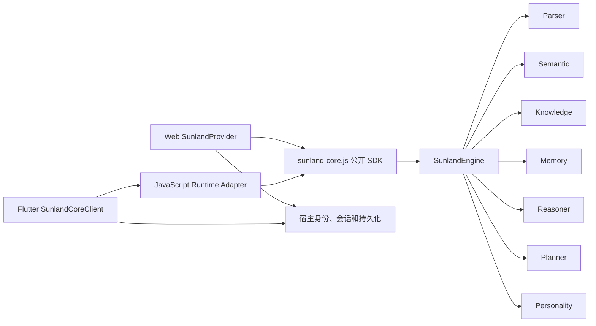

# Sunland Core SDK 架构

本文档定义 Sunland AI Core 的正式架构边界。`symbolic-ai` 是 Sunland AI
唯一的智能核心；Web、Flutter 以及未来宿主都只能通过公开 SDK 使用它。

## 文档导航

- [SDK 公开接口](./sdk.md)
- [Semantic 边界](./semantic.md)
- [Reasoning 边界](./reasoning.md)
- [Knowledge 边界](./knowledge.md)
- [Context 契约](./context.md)
- [Provider 集成](./provider-integration.md)
- [安全边界](./security-boundary.md)

## 唯一 Core 原则

1. `symbolic-ai/src` 中的 Parser、Semantic、Knowledge、Memory、Reasoner、
   Planner、Context 和 Personality 共同构成唯一 Core。
2. `src/sdk.ts` 是源码级唯一公开入口；发布后的唯一运行时入口是
   `sunland-core.js`。
3. Web Provider 直接导入发布 Bundle；Flutter 通过 Adapter 在 JavaScript
   容器中导入同一 Bundle。
4. 宿主只能负责身份校验、会话归属、状态持久化、取消控制和 UI 渲染，不能在
   JavaScript、Dart 或其他语言中复制 Core 决策逻辑。
5. Web 与 Flutter 发布产物必须来自同一次 `release:core`，并通过 SHA-256
   manifest 一致性检查。

## 运行时结构



所有智能决策都在 `SunlandEngine` 内完成。图中的宿主状态不属于 Core，也不能
改变 Core 的推理结果。

## Core 内部依赖方向

允许的总体方向为：

```text
types/utils -> parser / semantic / knowledge / memory / rules / personality
knowledge + rules -> reasoners
reasoning result -> planner
parser + semantic + knowledge + memory + reasoners + planner + personality
  -> engine -> sdk
```

`engine` 是组合根。模块之间可以通过类型接口协作，但上游模块不能反向依赖 UI
或宿主实现。Personality 只能改变表达方式，不能改写事实、置信度或推理结果。

## 外部禁止依赖的模块

外部宿主和 Provider 禁止直接导入以下路径：

- `src/engine/*`
- `src/parser/*`
- `src/semantic/*`
- `src/knowledge/*`
- `src/memory/*`
- `src/reasoners/*`
- `src/rules/*`
- `src/planner/*`
- `src/personality/*`
- `src/observation/*`
- `src/storage/*`
- `src/types/*`
- `src/graph/*`
- `src/App.tsx`、`src/main.tsx` 及其他 React/UI 文件
- `@/...` 路径别名

即使某个能力在 SDK 中公开，消费者也必须从 `src/sdk.ts` 或发布 Bundle 导入，
不能引用其实现文件。内部目录、类名、候选结构、规则 ID 和策略 ID 均不构成兼容
承诺。

## Core 禁止依赖的宿主模块

可发布 Core 不得依赖 React、Cytoscape、Supabase、DOM、WebView、Flutter SDK、
宿主认证、网络客户端、浏览器全局会话或 UI 状态。持久化只能通过注入的
`StorageAdapter` 完成。

## 变更约束

- 新宿主只能新增 Adapter，不得复制 Core。
- 公开 SDK 的删除、重命名或数据格式变化属于破坏性变更。
- 内部重构不得改变公开契约测试的观察结果。
- Core 算法变更必须由独立需求提出，不能夹带在 Provider 或 UI 改动中。
- 外部契约测试只允许通过 `src/sdk.ts` 观察行为。
